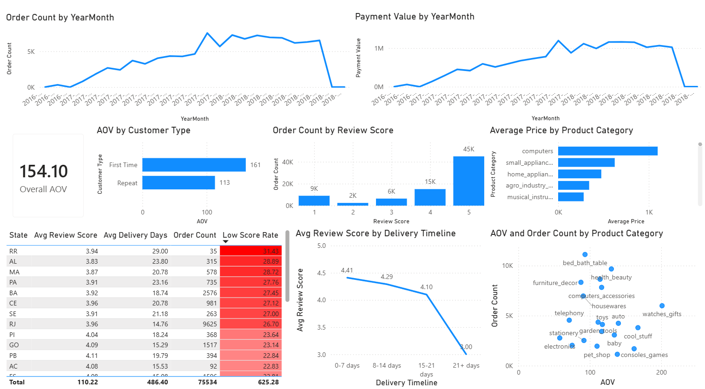

# Olist E-Commerce Analytics
**Tools:** PostgreSQL · Power BI  
**Dataset:** 100,000+ orders · 8 tables · 2016–2018  
**Platform:** Olist — Brazilian e-commerce marketplace

---

## Project Overview

Olist connects small Brazilian retailers to major e-commerce channels. This analysis covers the full business story — growth, retention, category performance, logistics CX, and customer sentiment — across 8 interconnected tables using PostgreSQL and Power BI.

The goal was not to report metrics but to diagnose what was driving performance and where the business had untapped opportunity.

---

## Key Findings

### 1. Growth Was Entirely Acquisition-Driven
Monthly orders grew 9x — from ~800 (2016) to 7,000+ (2017). Revenue tracked volume closely, with AOV staying flat at 148–163 BRL throughout. No evidence of upselling, retention improvement, or product mix shift. Olist grew by finding new customers, not by doing more with existing ones.

> **Implication:** The growth story looks strong on the surface. The underlying problem — zero retention — is invisible until you look at AOV and repeat rate together.

### 2. The Platform Behaved Like a Discovery Marketplace
Repeat customer rate: **3.12%**. First-time AOV (161 BRL) exceeded repeat AOV (113 BRL) — returning buyers purchased lower-ticket consumables, not premium items. Olist had essentially no habit-forming mechanism built into its model.

### 3. Category Sweet Spot — High AOV and High Volume
Three categories dominated on both dimensions:

| Category | AOV (BRL) | Orders |
|---|---|---|
| watches_gifts | 201 | 5,991 |
| cool_stuff | 167 | 3,796 |
| auto | 139 | 4,235 |

High-AOV niche categories (computers at 1,098 BRL, 203 orders) are unreliable for planning. High-volume low-AOV categories (bed_bath_table, housewares) drive engagement but not revenue. The sweet spot is where both converge.

**November 2017 Black Friday:** Order spike to 7,544 — nearly 2x normal volume. Household categories drove volume; watches/gifts drove revenue. Outlier: garden_tools generated 563 orders from only 93 SKUs — very few products drove disproportionate volume.

### 4. Delivery Is the Product
Customer satisfaction held stable up to 21 days — then collapsed.

| Delivery Time | Avg Review Score | Orders |
|---|---|---|
| 0–7 days | 4.41 | 26,575 |
| 8–14 days | 4.29 | 28,532 |
| 15–21 days | 4.10 | 12,073 |
| 21+ days | **3.00** | 8,502 |

The drop from 15–21 days to 21+ days is 1.10 points — the steepest single-bucket fall. The actionable threshold is 21 days, not 14.

Review text confirmed the logistics story. Top words in negative reviews: *não* (no/not), *recebi* (received — negative context), *ainda* (still waiting). Top words in positive reviews: *prazo* (on time — the #1 praise driver), *recomendo* (I recommend).

Product quality barely featured. **For Olist, delivery reliability is the product.**

### 5. Regional Analysis — Three-Stage Market Maturity Model
State-level analysis revealed a consistent pattern across order volume:

| Stage | Order Count | Pattern |
|---|---|---|
| Early | 1–25 | High variance, high dissatisfaction |
| Developing | 25–99 | Consistent mediocrity, avg score ~3 |
| Mature | 100+ | Process discipline improves significantly |

**SP standout:** 31,671 orders, 8.3 avg delivery days, 18.6% low score rate — the largest state is also one of the best performers. Scale brings process discipline.

**Problem cluster:** AL, MA, SE, PA, BA — all above 27% low score rate, all above 18 average delivery days.

**Outliers:** AM and RR have high delivery days but moderate scores — likely expectation adjustment in remote states where long delivery is the known norm.

> Order count alone does not determine satisfaction. Process quality does.

---

## Business Recommendations

1. **Prioritise seller acquisition in watches_gifts, auto, cool_stuff** — proven demand at meaningful AOV
2. **Eliminate 21+ day deliveries first** — particularly in AL, MA, SE, PA, BA. Speeding up already-fast deliveries has marginal impact
3. **Use SP as the operational benchmark** — scale with process discipline is achievable
4. **Benchmark struggling states against AC and RN** — small states with strong logistics performance despite limited volume
5. **Prepare for Black Friday** — the November spike is predictable and significant; logistics readiness is the lever
6. **Build retention mechanisms** — 3.12% repeat rate signals significant untapped revenue

---

## Technical Approach

**SQL (PostgreSQL)**
- Multi-table joins across 8 tables
- Subqueries and nested CTEs for multi-level aggregation
- CASE logic for delivery time bucketing and customer segmentation
- Regex-based text mining for review sentiment (Portuguese)
- Subqueries for regional maturity model and state-level performance analysis
- Data quality handling — corrupted CSV rows, geolocation duplicates, empty timestamp strings

**Power BI**
- Interactive dashboard covering growth trends, AOV, retention, category performance, delivery CX, and regional analysis
- Custom measures for low score rate and delivery bucket classification

**Data Quality Issues Resolved**
- `review_score` column stored as text with corrupted rows — filtered using regex before casting
- Geolocation table had 10–20 duplicate coordinate entries per zip code — resolved with DISTINCT before joining
- Delivery timestamp initially calculated incorrectly (review timestamp minus delivery date) — corrected to purchase timestamp minus delivery date, which materially changed the CX findings

---

## Dataset

[Olist Brazilian E-Commerce Dataset](https://www.kaggle.com/datasets/olistbr/brazilian-ecommerce) — Kaggle  
8 tables: orders, customers, products, payments, reviews, sellers, geolocation, product category translations

---

*Analysis by Aman Vyas · [LinkedIn](https://www.linkedin.com/in/aman-vyas-b82a26121/) · [GitHub](https://github.com/human-aman)*
